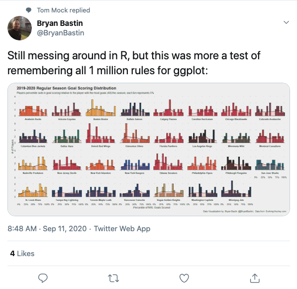

```{r, include = FALSE}
# This is the recommended set up for flipbooks
# you might think about setting cache to TRUE as you gain practice --- building flipbooks from scratch can be time consuming
knitr::opts_knit$set(fig.width = 6, message = FALSE, warning = FALSE, comment = "", cache = F)
options(warn=-1)

library(flipbookr)
library(tidyverse)
library(haven)
library(gghalves)
```

```{r xaringan-themer, include=FALSE, warning=FALSE}
library(xaringanthemer)
style_mono_accent(
  base_color = "#FFA700",
  header_font_google = google_font("Podkova"),
  text_font_google   = google_font("Work Sans", "300", "300i"),
  code_font_google   = google_font("Fira Mono")
)
```

## Welcome!

This tutorial will demonstrate how to create basic figures in R

To follow along with the workshop in R, you will need to have **already installed** R and R Studio

---

## How to follow along and participate

* Open R Studio

* Install `tidyverse`, `gghalves`, and `haven` if you do not have them already

* Open the workshop R Markdown file and click on the **tiny** green arrow on the top right corner of the gray shaded area (this is a code chunk!) that contains this: 

```{r eval = FALSE}

library(package = "tidyverse")
library(package = "haven")
library(package = "gghalves")

```

* The arrow will run all the code in that "chunk" of code

---

## The data set

* We will be using the **Global Attitudes & Trends** data set from the **Pew Internet & American Life** website 

    + If needed, download the data and documentation from this website: <a href = "https://www.pewresearch.org/global/datasets/">https://www.pewresearch.org/global/datasets/</a>
    
---

## Importing data into R

* Before running this code, make sure the participant file and the data file are saved in the same folder on your computer with the file called `Participant documents.Rproj`

* Use the little green arrow at the top of the code chunk to run this code

```{r echo = FALSE}

# use read_spss function to read the spss file 
globalData2019 <- read_spss(file = "Participant documents/Pew Research Center Global Attitudes Spring 2019 Dataset WEB.sav")

```

```{r eval = FALSE}

# use read_spss function to read the spss file 
globalData2019 <- read_spss(file = "Pew Research Center Global Attitudes Spring 2019 Dataset WEB.sav")

```

---

## Data cleaning 

* Run the next code chunk (`chunk3`), which uses `tidyverse` to clean the data set so it is ready to visualize

```{r}
globalData2019clean <- globalData2019 %>%
  filter(country %in% c(16, 21, 26, 34)) %>% 
  select(country, SEX, AGE, BETTER_GENDER, COUNTRY_SATIS, 
         ECON_SIT, LADDER_NOW) %>% 
  zap_labels() %>%
  mutate(AGE = na_if(AGE, 98)) %>% 
  mutate(AGE = na_if(AGE, 99)) %>% 
  mutate(LADDER_NOW = na_if(LADDER_NOW, 98)) %>% 
  mutate(LADDER_NOW = na_if(LADDER_NOW, 99)) %>% 
  mutate(country = recode_factor(country,
                             '16' = 'Kenya',
                             '21' = 'Nigeria',
                             '26' = 'South Africa',
                             '34' = 'United States')) %>%
  mutate(SEX = recode_factor(SEX,
                             '1' = 'Male',
                             '2' = 'Female')) %>% 
  mutate(BETTER_GENDER = recode_factor(BETTER_GENDER,
                                    '1' = 'Men',
                                    '2' = 'Women',
                                    '3' = 'Same/both equally',
                                    '8' = NA_character_,
                                    '9' = NA_character_)) %>% 
  mutate(COUNTRY_SATIS = recode_factor(COUNTRY_SATIS,
                                       '1' = 'Satisfied',
                                       '2' = 'Dissatisfied',
                                       '8' = NA_character_,
                                       '9' = NA_character_)) %>% 
  mutate(ECON_SIT = recode_factor(ECON_SIT,
                                  '1' = 'Very good',
                                  '2' = 'Somewhat good',
                                  '3' = 'Somewhat bad',
                                  '4' = 'Very bad',
                                  '8' = NA_character_,
                                  '9' = NA_character_)) 
```

---

## Check your work

```{r}
summary(object = globalData2019clean)
```

---

## Using the ggplot2 package for plotting

* Part of the `tidyverse` set of packages in R

* `gg` stands for **grammar** of **graphics**

* Plots created in `ggplot2` are built in layers 

* Let's look at some examples

* First, a bar chart...

---

`r chunk_reveal("my_bar", widths = c(1,1), title = "## Basic bar chart")`

```{r my_bar, include = FALSE}
globalData2019clean %>%
  ggplot(aes(x = SEX)) +
  geom_bar() 
```

---

`r chunk_reveal("my_bar_fancy", widths = c(1,1), title = "## Fancy bar chart")`

```{r my_bar_fancy, include = FALSE}
globalData2019clean %>%
  ggplot(aes(x = SEX)) +
  geom_bar(fill = "deeppink") +
  labs(x = "Sex",
       y = "Frequency",
       title = "Sex of 5001 participants in a 2019 survey of people from Kenya,\nNigeria, South Africa, and the United States.") +
  theme_minimal()
```

---

`r chunk_reveal("my_bar_fancy_colors", widths = c(1,1), title = "## Fancy bar chart with colors")`

```{r my_bar_fancy_colors, include = FALSE}
globalData2019clean %>%
  ggplot(aes(x = SEX, fill = SEX)) +
  geom_bar() +
  labs(x = "Sex",
       y = "Frequency",
       title = "Sex of 5001 participants in a 2019 survey of\npeople from Kenya, Nigeria,\nSouth Africa, and the United States.") +
  scale_fill_brewer(palette = "Set1") +
  theme_minimal(base_size = 14)
```

---

`r chunk_reveal("my_bar_fancy_legend", widths = c(1,1), title = "## Super fancy bar chart")`

```{r my_bar_fancy_legend, include = FALSE}
globalData2019clean %>%
  ggplot(aes(x = SEX, fill = SEX)) +
  geom_bar() +
  labs(x = "Sex",
       y = "Frequency",
       title = "Sex of 5001 participants in a 2019 survey of\npeople from Kenya, Nigeria,\nSouth Africa, and the United States.") +
  scale_fill_brewer(palette = "Set1") +
  theme_minimal(base_size = 14, base_family = "serif") +
  theme(legend.position = "none") 
```

---

## You try it!

Make a bar chart of the `BETTER_GENDER` responses from survey participants.

Edit the code below to: 

* Use `BETTER_GENDER` as the fill variable in the `ggplot()` layer

* Change the color of the bars by replacing "Set2" with the name of another palette (hint: palette names can be found by using the Help tab and entering scale_fill_brewer)

* Add labels for the axes and a title inside the quote marks (see codebook for more about the question)

* Replace `theme_minimal()` with another theme, you can find them by typing `theme_` into the Help tab

* Play with the `base_size = ` by trying different numbers

When you have completed the changes, click the little green arrow on the top right of the code chunk to run the code.

---

`r chunk_reveal("you-try", widths = c(1,1), title = "## You try it example")`

```{r you-try, eval = F, echo = F}
globalData2019clean %>%
  ggplot(aes(x = BETTER_GENDER, fill = BETTER_GENDER)) +
  geom_bar() +
  labs(x = "Who has better life",
       y = "Frequency",
       title = "Opinion on quality of life by gender for\n5001 participants in a 2019 survey of people from Kenya,\nNigeria, South Africa, and the United States.") +
  scale_fill_brewer(palette = "Paired") + 
  theme_bw(base_size = 16, base_family = "serif") +
  theme(legend.position = "none") 
```

---

`r chunk_reveal("you-try2", widths = c(1,1), break_type = "rotate", title = "## You try it example")`

```{r you-try2, eval = F, echo = F}
globalData2019clean %>%
  ggplot(aes(x = BETTER_GENDER, fill = BETTER_GENDER)) +
  geom_bar() +
  labs(x = "Who has better life",
       y = "Frequency",
       title = "Opinion on quality of life by gender for\n5001 participants in a 2019 survey of people from\nKenya, Nigeria, South Africa, and United States.") +
  scale_fill_brewer(palette = "Set1") + #ROTATE
  scale_fill_brewer(palette = "Set1", na.value = "orange") + #ROTATE
  theme_bw(base_size = 12, base_family = "mono") +
  theme(legend.position = "none") 
```
---

`r chunk_reveal("stacked_bar", widths = c(1,1), title = "## Stacked bar plot")`

```{r stacked_bar, include = FALSE}

globalData2019clean %>% 
  drop_na(BETTER_GENDER) %>% 
  ggplot(aes(x = BETTER_GENDER, fill = SEX)) +
  geom_bar() +
  labs(x = "Who has better life",
       y = "Frequency",
       title = "Who has a better life by sex according to 5001\nparticipants in a 2019 survey of people from Kenya,\nNigeria, South Africa, and United States.") +
  scale_fill_brewer(palette = "Paired") +
  theme_minimal(base_size = 12, base_family = "mono") 
```


---

`r chunk_reveal("grouped_bar", widths = c(1,1), title = "## Grouped bar plot")`

```{r grouped_bar, include = FALSE}

globalData2019clean %>% 
  drop_na(BETTER_GENDER) %>% 
  ggplot(aes(x = BETTER_GENDER, fill = SEX)) +
  geom_bar(position = "dodge") +
  labs(x = "Who has better life",
       y = "Frequency",
       title = "Who has a better life by sex according to 5001 participants\nin a 2019 survey of people from Kenya, Nigeria, South Africa,\nand the United States.",
       fill = "Survey participant sex") +
  scale_fill_brewer(palette = "Paired") +
  theme_minimal(base_size = 12, base_family = "serif") 
```

---

## You try it!

* Create a grouped bar plot for Figure 2 with `COUNTRY_SATIS` as the x-axis and `SEX` as the fill color 

* Drop the `NA` values for `COUNTRY_SATIS`

* Add good labels for the x-axis, y-axis, title (may need the codebook for this)

* Format it using a palette you like  

* Fix the legend title so it is "Participant sex"

```{r}
# Figure 2 code goes here

```


---

`r chunk_reveal("answerYti", widths = c(1,1), title = "## Answer to You try it!")`

```{r answerYti, include = FALSE}
# Figure 2 code goes here
globalData2019clean %>% 
  drop_na(COUNTRY_SATIS) %>% 
  ggplot(aes(x = COUNTRY_SATIS, fill = SEX)) +
  geom_bar(position = "dodge") +
  labs(x = "Satisfied or dissatisfied with the way things\nare going in our country ",
       y = "Frequency",
       title = "Country satisfaction by sex according to 5001 participants\nin a 2019 survey of people from Kenya, Nigeria, South Africa,\nand the United States.", 
       fill = "Participant sex") +
  scale_fill_brewer(palette = "Paired") +
  theme_minimal() 

```


---

```{r, echo=FALSE, out.width = 600, fig.align='center'}
   
```

---

`r chunk_reveal("percents", widths = c(1,1), title = "## Group percentages")`

```{r percents, include = FALSE}
globalData2019clean %>% 
  group_by(COUNTRY_SATIS, SEX) %>% 
  count() %>% 
  group_by(COUNTRY_SATIS) %>% 
  mutate(perc = 100 * (n / sum(n))) 
```

---

`r chunk_reveal("grouped_bar_perc", widths = c(1,1), title = "## Grouped bar plot")`

```{r grouped_bar_perc, include = FALSE}

globalData2019clean %>% 
  group_by(COUNTRY_SATIS, SEX) %>% 
  count() %>% 
  group_by(COUNTRY_SATIS) %>% 
  mutate(perc = 100 * (n / sum(n))) %>% 
  drop_na(COUNTRY_SATIS) %>% 
  ggplot(aes(x = COUNTRY_SATIS, y = perc, fill = SEX)) +
  geom_col(position = "dodge") +
  labs(x = "Satisfied or dissatisfied with the way things\nare going in our country ",
       y = "Percentage within satisfaction group",
       title = "Country satisfaction by sex according to 5001 participants\nin a 2019 survey of people from Kenya, Nigeria, South Africa,\nand the United States.", 
       fill = "Participant sex") +
  scale_fill_brewer(palette = "Paired") +
  theme_minimal()
```

---

`r chunk_reveal("histogram", widths = c(1,1), title = "## Histogram")`

```{r histogram, include = FALSE, warning=FALSE}
# Histogram for age
globalData2019clean %>% 
  ggplot(aes(x = AGE)) +
  geom_histogram() 
```

---

`r chunk_reveal("fancyhistogram", widths = c(1,1), title = "## Fancy histogram")`

```{r fancyhistogram, include = FALSE}
# Histogram for age
globalData2019clean %>% 
  ggplot(aes(x = AGE, fill = SEX)) +
  geom_histogram(color = "white") +
  labs(x = "Participant age (years)",
       y = "Frequency",
       title = "Age distribution by sex for 5001 participants in a 2019 survey\nof people from Kenya, Nigeria, South Africa, and the United States.") +
  scale_fill_brewer(palette = "Set1") +
  facet_grid(rows = vars(SEX)) +
  theme_minimal() +
  theme(legend.position = "none")
```

---

`r chunk_reveal("boxplot", widths = c(1,1), title = "## Box plot")`

```{r boxplot, include = FALSE}

globalData2019clean %>% 
  ggplot(aes(x = SEX, y = AGE)) +
  geom_boxplot() +
  labs(x = "Participant sex",
       y = "Age",
       title = "Age by sex for 5001 participants in a 2019 survey of people\nfrom Kenya, Nigeria, South Africa, and the United States.") +
  theme_minimal() 
```

---

`r chunk_reveal("fancybox", widths = c(1,1), title = "## Fancier box plot")`

```{r fancybox, include = FALSE}

globalData2019clean %>% 
  ggplot(aes(x = SEX, y = AGE, color = SEX)) +
  geom_half_boxplot() +
  geom_half_point(alpha = .4) +
  labs(x = "Participant sex",
       y = "Age",
       title = "Age by sex for 5001 participants in a 2019 survey of people\nfrom Kenya, Nigeria, South Africa, and the United States.") +
  theme_minimal() +
  theme(legend.position = "none")
```
---

`r chunk_reveal("fancybox2", widths = c(1,1), title = "## Rain cloud plot")`

```{r fancybox2, include = FALSE}

globalData2019clean %>% 
  ggplot(aes(x = SEX, y = AGE, color = SEX, fill = SEX)) +
  geom_half_violin(side = "r") +
  geom_half_point(alpha = .3, side = "l") +
  labs(x = "Participant sex",
       y = "Age",
       title = "Age by sex for 5001 participants in a 2019 survey of people from\nKenya, Nigeria, South Africa, and the United States.") +
  scale_color_brewer(palette = "Dark2") +
  scale_fill_brewer(palette = "Dark2") +
  theme_minimal() +
  coord_flip() +
  theme(legend.position = "none")
  
```

---

`r chunk_reveal("groupboxplot", widths = c(1,1), title = "## Grouped box plot")`

```{r groupboxplot, include = FALSE}

globalData2019clean %>% 
  ggplot(aes(y = LADDER_NOW, x = country, color = SEX)) +
  geom_boxplot() +
  labs(x = "Country",
       y = "Life ladder (0 = worst, 10 = best)",
       title = "Life ladder by sex and country for 5001 participants in a 2019 survey\nof people from Kenya, Nigeria, South Africa, and the United States.",
       color = "Sex") +
  theme_minimal() 
```

---

`r chunk_reveal("grouprain", widths = c(1,1), title = "## Grouped rain cloud plot")`

```{r grouprain, include = FALSE}

globalData2019clean %>% 
  ggplot(aes(y = LADDER_NOW, x = country, fill = SEX, color = SEX)) +
  geom_half_violin(side = "r") +
  geom_half_point(alpha = .3, side = "l") +
  labs(x = "Country",
       y = "Life ladder (0 = worst, 10 = best)",
       title = "Life ladder by sex and country for 5001 participants in a 2019 survey\nof people from Kenya, Nigeria, South Africa, and the United States.",
       color = "Sex",
       fill = "Sex") +
  theme_minimal() +
  coord_flip() +
  scale_color_brewer(palette = "Paired") +
  scale_fill_brewer(palette = "Paired") 
  
```

---

`r chunk_reveal("grouprainfacet", widths = c(1,1), title = "## Grouped rain cloud plot with facets")`

```{r grouprainfacet, include = FALSE}

globalData2019clean %>% 
  ggplot(aes(y = LADDER_NOW, fill = SEX, color = SEX)) +
  facet_wrap(facets = vars(country)) +
  geom_half_violin(side = "r") +
  geom_half_point(alpha = .3, side = "l") +
  labs(x = "Country",
       y = "Life ladder (0 = worst, 10 = best)",
       title = "Life ladder by sex and country for 5001 participants in a 2019 survey\nof people from Kenya, Nigeria, South Africa, and the United States.",
       color = "Sex",
       fill = "Sex") +
  theme_minimal() +
  coord_flip() +
  scale_color_brewer(palette = "Paired") +
  scale_fill_brewer(palette = "Paired") 
  
```

---

## The final challenges...choose one or try them all!

* Make a bar graph showing percentage of participants in each category of ECON_SIT 

* Create a figure that shows grouped bar plots for GLOBAL_COMMUNITY grouped by country

* Create a figure that shows grouped bar plots for country and COUNTRY_SATIS

* Create a figure that shows grouped bar plots for COUNTRY_SATIS grouped by country and SEX

* Create a figure that shows the distribution of AGE by country and SEX

---

## The end

* Email me at **[harrisj@wustl.edu](mailto:harrisj@wustl.edu)**

* Connect with me on Twitter **[@jenineharris](https://twitter.com/jenineharris)**

<br><BR>
```{r, echo=FALSE, out.width = 600, fig.align='center'}
   knitr::include_graphics('https://academichive.com/wp-content/uploads/2017/01/HIVE-001-300x142.png')
```


<!-- adjust font size in this css code chunk, currently 80 -->

```{css, eval = TRUE, echo = FALSE}
.remark-code{line-height: 1.5; font-size: 90%}

@media print {
  .has-continuation {
    display: block;
  }
}

code.r.hljs.remark-code{
  position: relative;
  overflow-x: hidden;
}


code.r.hljs.remark-code:hover{
  overflow-x:visible;
  width: 500px;
  border-style: solid;
}
```


